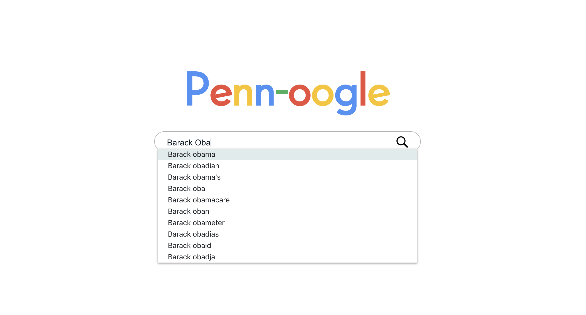
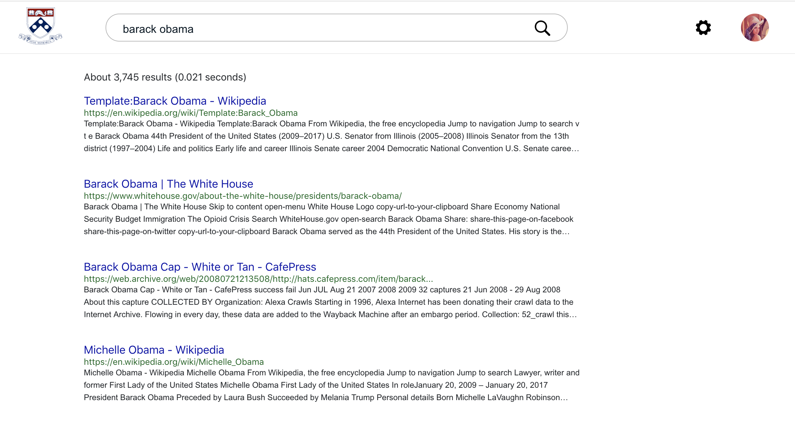
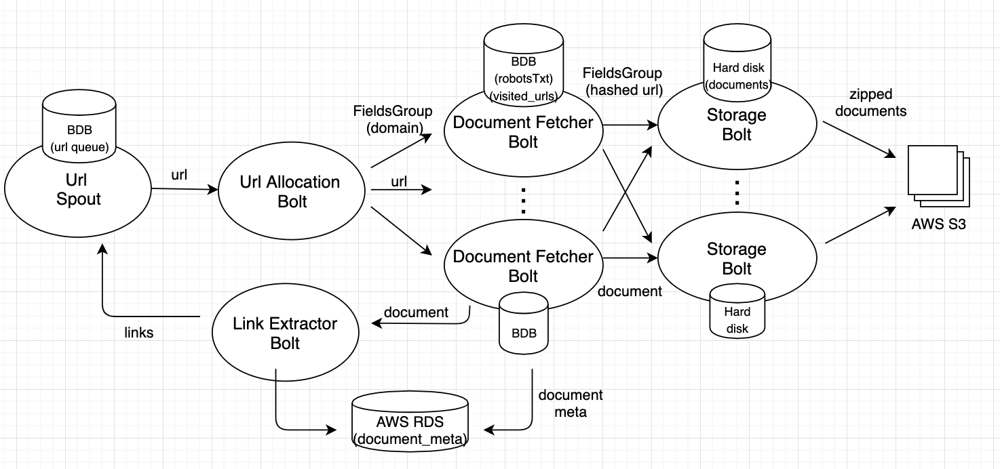
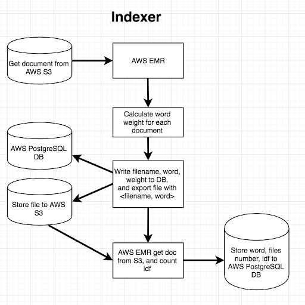

## Poogle
Poogle is a search engine designed to provide fast and accurate results for users. Our search engine indexes more than 1.5 million documents and generates search results within 0.1 seconds on average.

## Demo
http://ec2-52-55-15-87.compute-1.amazonaws.com/

## Screenshots

## Group Members
| <a href="https://github.com/garatee">**Chen-Ping Liao**</a> | <a href="https://github.com/pedoe">**Chih-Sheng Huang**</a> |
| :---: |:---:|
|  |  |
| <a href="https://github.com/garatee">`github.com/garatee`</a> | <a href="http://github.com/pedoe">`github.com/pedoe`</a> | 

## Private repositories
Source code for Poogle is not released. Following repositories are private.
- <a href="https://github.com/garatee/555-crawler"> Crawler </a>: crawled more than 1.5 million documents within 24 hours using 12 EC2 instances.
- <a href="https://github.com/garatee/555-indexer"> Indexer </a>: indexed the 1.5 million crawled documents using AWS EMR map reduce.
- <a href="https://github.com/garatee/555-pagerank"> Page Rank </a>: a ranking system to give authoritative websites higher priority
- <a href="https://github.com/garatee/555-backend" > Backend </a>: balances indexer and page rank scores to generate search results
- <a href="https://github.com/garatee/555-frontend"> Frontend </a>: UI display for users

## Crawler

Our distributed web crawler is built on StormLite topology and can crawl at least 1.5 million documents within 24 hours using 12 EC2 instances.  The crawler stores zipped documents on AWS S3 for the indexer to parse, and stores the <a href="screenshots/crawler_3.png"> document meta </a> on AWS RDS for the search engine to retrieve.   
crawler_3

We also have additional features as below:
- <a href="screenshots/crawler_1.png"> Master-Worker architecture</a>: Worker server periodically pings the master, and the master relies on the ping to decide which worker is alive.
- <a href="screenshots/crawler_4.png"> Status Monitoring page</a>: We have 12 EC2 workers and therefore we need a web api to monitor the status of each worker. We designed a status monitoring page (as screenshot below) for users to start, monitor, and end all of the crawlers.
- Respects Robots.txt:  our polite crawler respects robot policies and has a 1-second default crawl delay per domain.
- Blacklist feature: to avoid spider traps, users can add domain to black list during crawl time  

## Indexer

Our indexer calculates the TF_IDF weight of each word.
In order to get word weight in each document and the IDF in all documents, we design two steps MapReduce job to obtain the result. 

First MapReduce job will get all documents from AWS S3 (crawler will store all the data it crawled to S3 in advance) and start to do the word count for each document. When all the word in the document is extracted and the word count is known, the job for calculating word weight for each document will start then store the result to AWS PostgreSQL DB(The data columns in DB is filename, word, weight, count). At the same time, it will write data to a file in reduce job to record <filename, word>, which is used to calculate IDF in second MapReduce job. 

In the second MapReduce job, the AWS EMR will grab the documents which are generated in the previous MapReduce job to get an inverted index with a list of document names. Therefore, we can obtain times of word shown in all the documents. In the reduce job, we will calculate the IDF and store data to AWS PostgreSQL DB.

## Page Rank
We compute Page Rank according to domains(not urls, we are not Google and we don't have that much data!).
We implement our page rank algorithm according to the following formula.

  

## Backend
Our backend search engine uses the Java Spark Framework.  It provides 3 apis.
- **/data**: This api provides search results by combining indexer and pagerank scores.
- **/autocomplete**: This api provides word autocomplete suggestions.
- **/spellcheck**: This api provides spell-check suggestions.

## Frontend
We use React as the front end.